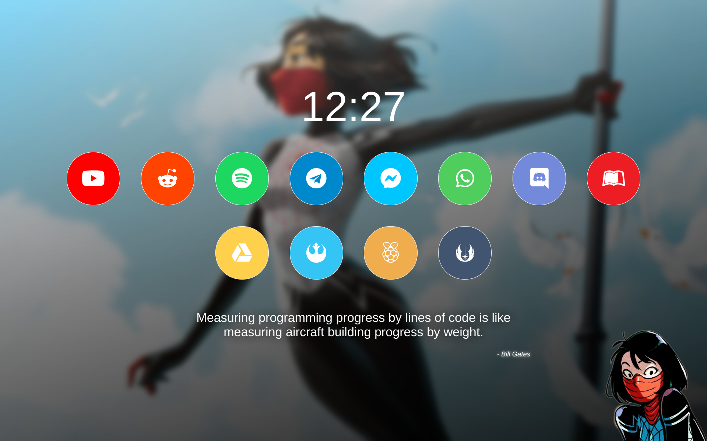
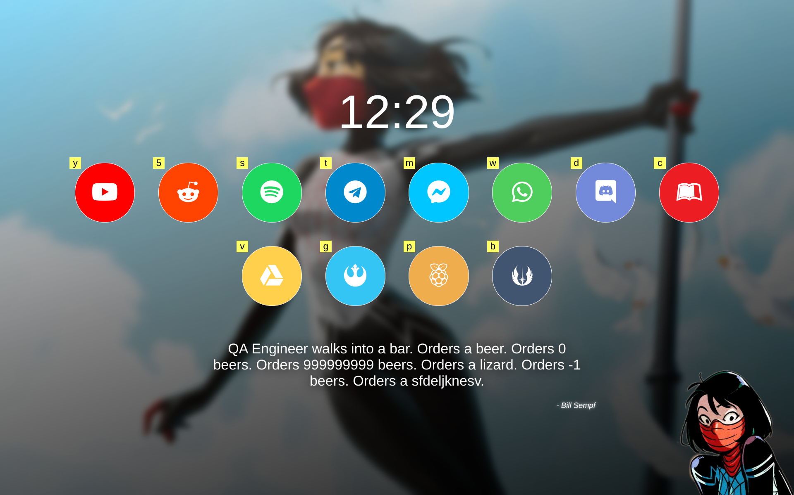
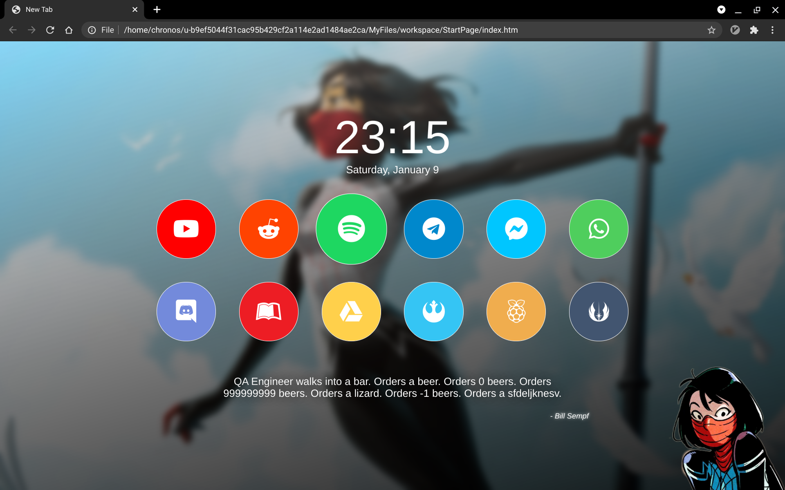

A custom start page for my Chrome browser. It's really just for personal use and I plan to update it as needed.

   * [StartPage](#startpage)
   * [Description](#description)
   * [Configuration](#configuration)
      * [Root](#root)
      * [Modules](#modules)
      * [Buttons](#buttons)
      * [Button Image](#button-image)
   * [Usage](#usage)
   * [Attribution](#attribution)
      * [/r/startpages](#rstartpages)
      * [Envato Tuts+](#envato-tuts)
      * [FontAwesome](#fontawesome)
      * [MDN Web Docs](#mdn-web-docs)
      * [Programming Quotes API](#programming-quotes-api)
      * [Silk](#silk)
      * [Vimium](#vimium)
      * [W3Schools](#w3schools)

# Description
I'm no webdev or designer so I made something super simple. I *am* a dev, though, so it's probably over-engineered and super complex.





# Configuration
The page is configured using a `config` object that needs to be added to the HTML page before `script.js` is called. Currently the the main page points to a non-existent `config` in its own file in `js/config.js`. You can rename `js/config-example.js` to use the pre-populated example.

```javascript
const config = {
    background: "img/silk-wall.jpg",
    foreground: "img/silk-sticker.webp",
    modules: [
        {
            type: "time",
        },
        {
            type: "quote"
        },
        [
            {
                key: "y",
                url: "https://www.youtube.com/",
                color: "#ff0000",
                image: {
                    type: "awesome",
                    classes: [
                        "fab",
                        "fa-youtube"
                    ]
                }
            }
        ]
    ]
};
```

## Root
The root of the config object has 3 properties: `background`, `foreground`, and `modules`.

| Property     | Required | Type   | Description                                                                   |
| ------------ | -------- | ------ | ----------------------------------------------------------------------------- |
| `background` | `true`   | String | The URL for the image that will be shown in the background of the page.       |
| `foreground` | `true`   | String | The URL for the image that will be shown in the foreground of the page.       |
| `modules`    | `true`   | Array  | A list of Module items that will be rendered on the screen.                   |

## Modules
The `modules` Array holds Module objects. These are shown in order as a vertical list on the screen.

| Property | Required | Type   | Description                                          |
| -------- | -------- | ------ | ---------------------------------------------------- |
| `type`   | `true`   | String | Can either be `time`, `date`, `quote`, or `buttons`. |
| `data`   | `true`   | String | The data for the module. Can be empty.               |

## Buttons
The buttons that appear in the `data` section of `buttons` type modules.

| Property | Required | Type   | Description                                                          |
| -------- | -------- | ------ | -------------------------------------------------------------------- |
| `key`    | `true`   | String | The keyboard shortcut to activate this button.                       |
| `url`    | `true`   | String | The URL this button will navigate to.                                |
| `color`  | `true`   | String | The color of the button.                                             |
| `image`  | `true`   | Object | An object that contains the information for the image on the button. |

## Button Image
The image that is shown on the button can be an image or an awesome font character.

| Property  | Required | Type   | Description                                                                       |
| --------- | -------- | ------ | --------------------------------------------------------------------------------- |
| `type`    | `true`   | String | Can be `awesome` for an awesome icon.                                             |
| `classes` | `true`   | Array  | The classes to apply to the image. This is important for awesome font characters. |

# Usage
Set this as your start page to have Cindy Moon show up whenever you open a new tab.

Press `r` to refresh the page and `f` to show the hints for keyboard shortcuts. Press a keyboard shortcut or click a button to open that page.

The time will update every second but will use your computer time.

The quote will update once a day and uses local storage as a cache.

# Attribution
This section lists all the resources I used or was inspired by.

## /r/startpages
Before starting this page I browsed [/r/startpages](https://reddit.com/r/startpages) for ideas and inspiration.

## Envato Tuts+
I used a method on [Envato Tuts+](https://webdesign.tutsplus.com) to create the frosted glass effect. Specifically, I chose Method 2 on [this page](https://webdesign.tutsplus.com/tutorials/how-to-create-a-frosted-glass-effect-in-css--cms-32535) written by [Adi Purdila](https://tutsplus.com/authors/adi-purdila) because it was simple and I had no need for multi-browser support.

## FontAwesome
I am using [Font Awesome](https://fontawesome.com/) for the brand images in the buttons. It is a super simple way to add logos that I can customize like text.

## MDN Web Docs
I had to rely on [MDN Web Docs](https://developer.mozilla.org/en-US/) for how to use arrow functions and promises.

## Programming Quotes API
The quotes on the page are retrieved using the [Programming Quotes API](http://quotes.stormconsultancy.co.uk/api) built by [@adam_pope](https://twitter.com/adam_pope) of Storm Consultancy.

## Silk
The images I am using for the background and foreground were found using Google Images when I searched for Cindy Moon. The foreground I chose seems to come from [Silk (2015) #1](https://www.marvel.com/comics/issue/55637/silk_2015_1) and the background from [Silk (2015) #19](https://www.marvel.com/comics/issue/61052/silk_2015_19).

## Vimium
I use [Vimium](https://chrome.google.com/webstore/detail/vimium/dbepggeogbaibhgnhhndojpepiihcmeb?hl=en) on most sites, particularly for the keyboard shortcuts. It was important to have that on this page too, so I modeled my hints after Vimium's.

## W3Schools
The examples on [W3Schools](https://www.w3schools.com/) was very helpful for CSS.

